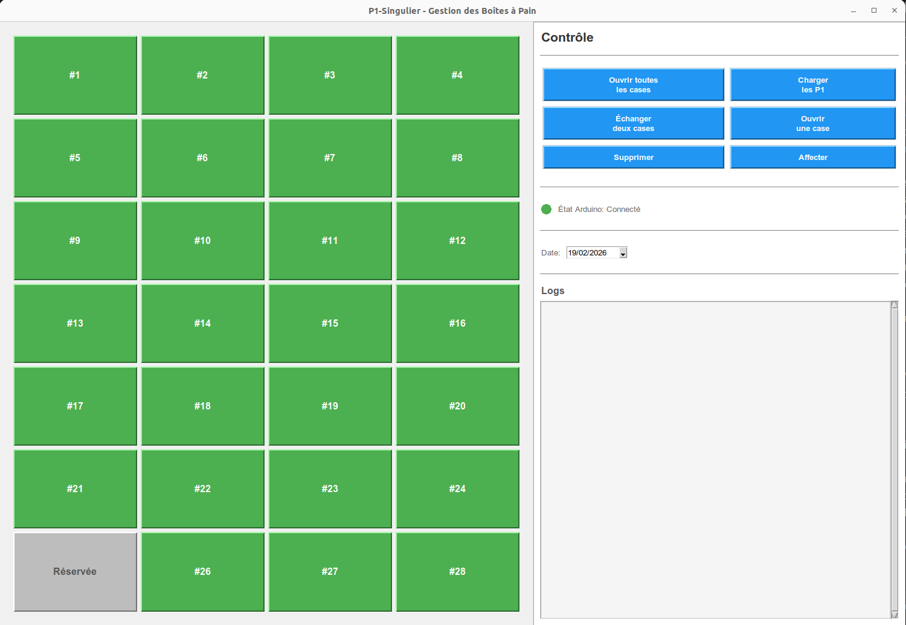

# 📦 P1-Singulier

Système intelligent de gestion de boîtes à pain contrôlées par Arduino avec interface graphique intuitive.

## 🎯 Vue d'ensemble

P1-Singulier est une application complète permettant de gérer l'inventaire de boîtes à pain :
- Communication en temps réel avec l'Arduino
- Gestion des utilisateurs et badges RFID
- Logs détaillés des opérations
- Interface graphique moderne et responsive

### Interface



## 🚀 Démarrage rapide

### Prérequis

- Python 3.8+
- pip (gestionnaire de paquets Python)

### Installation

```bash
# Cloner et accéder au répertoire
cd p1-singulier

# Installer les dépendances
pip install -r requirements.txt

# Lancer l'application
cd client
python main.py
```

## 📁 Structure du projet

```
p1-singulier/
├── client/              # Application Python MVC
│   ├── main.py          # Point d'entrée
│   ├── controller/      # Logique applicative
│   ├── model/           # Gestion des données
│   └── view/            # Interface graphique
├── serveur/             # Code Arduino
├── config/              # Fichiers de configuration
├── badges/              # Base des utilisateurs (RFID)
├── logs/                # Historique des opérations
├── commandes/           # Commandes en cours
├── extras/              # Ressources (images, etc.)
├── requirements.txt     # Dépendances Python
└── README.md
```

## ⚙️ Architecture

Le projet utilise l'architecture **MVC** pour une séparation claire des responsabilités :

- **Model** : Gestion des données, logique métier
- **View** : Interface utilisateur (Tkinter)
- **Controller** : Orchestration entre Model et View

## 🔧 Fonctionnalités

- ✅ Gestion en temps réel des 28 boîtes
- ✅ Affectation d'utilisateurs aux cases
- ✅ Ouverture/suppression de cases
- ✅ Échange de contenus entre cases
- ✅ Système de logs détaillés
- ✅ Sélection de date pour filtrer les opérations

## 📝 Licence

© 2026 - Projet P1-Singulier
